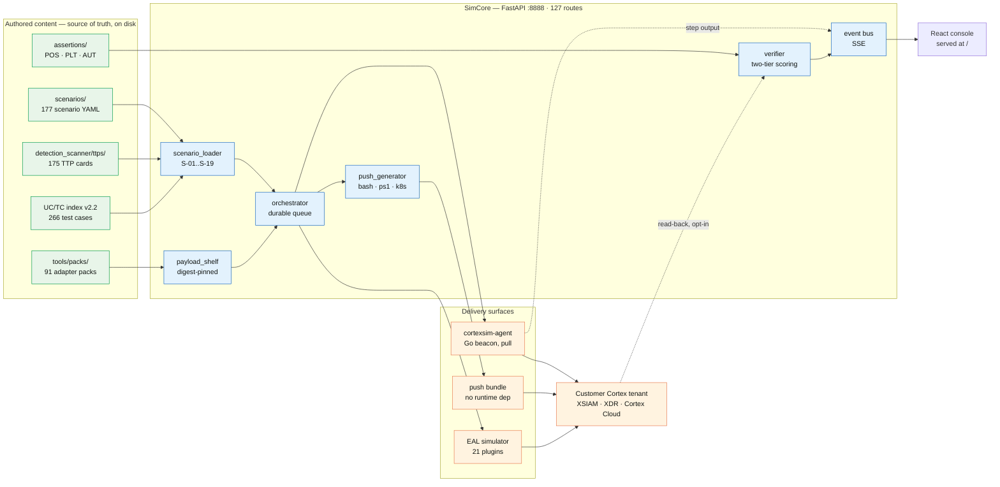
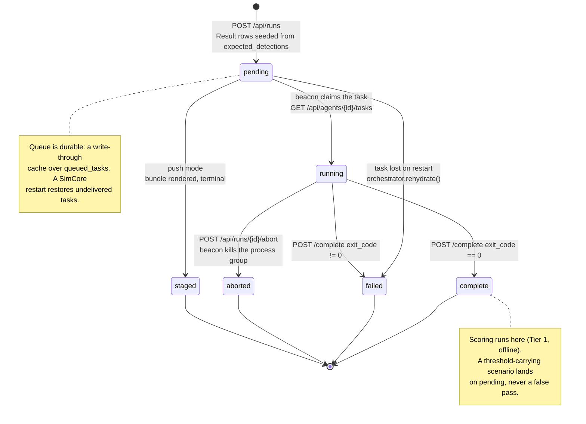
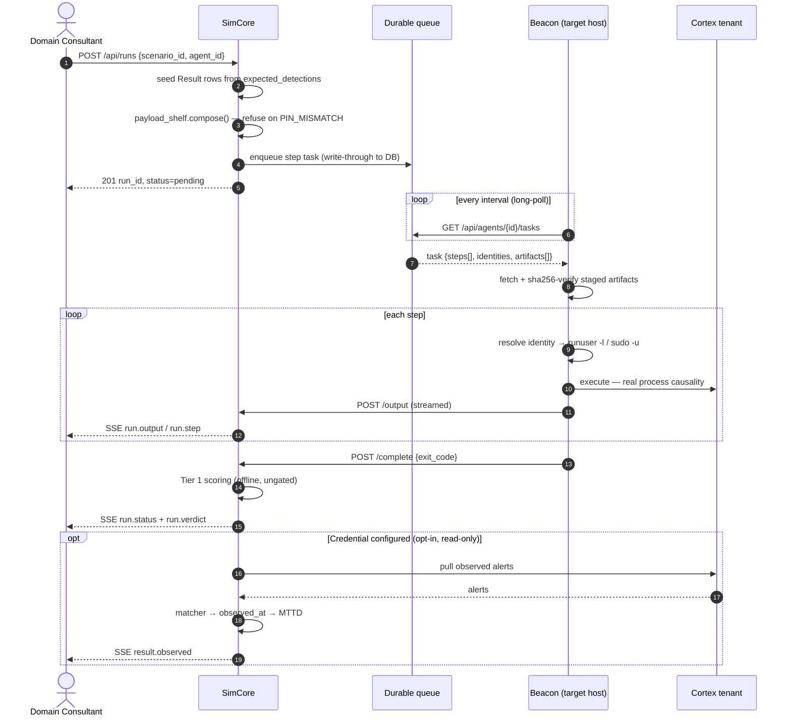
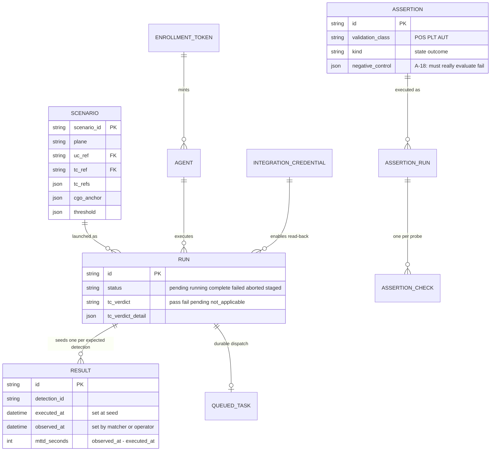
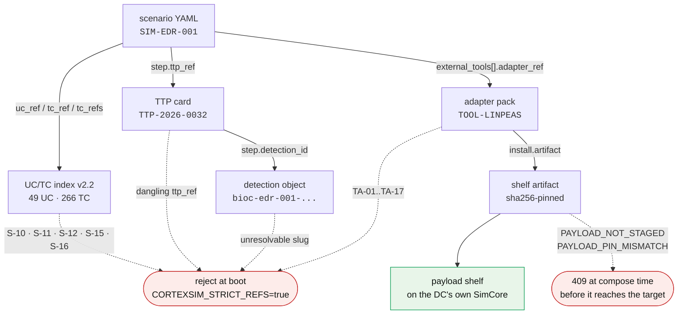
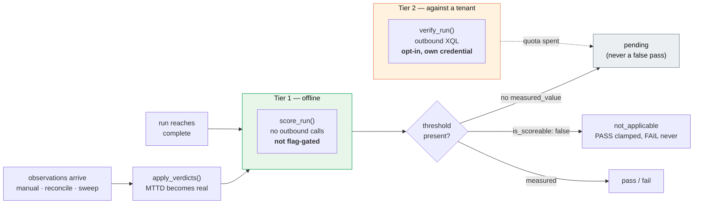

<div align="center">

# CortexSim

**A detection quality-assurance engine for Palo Alto Networks Cortex.**

[](https://github.com/hankthebldr/cortex-pov-engine/actions/workflows/ci.yml)
[](docs/reference/ground-truth.md)
[](docs/reference/ground-truth.md)
[](docs/reference/ground-truth.md)
[](#read-this-before-anything-else)

[](core/requirements.txt)
[](agent/go.mod)
[](ui/package.json)
[](https://github.com/hankthebldr/cortex-pov-engine/wiki)

</div>

CortexSim generates controlled, high-fidelity attack signal into a Cortex
environment (XSIAM/XDR) so a Domain Consultant can validate detection logic —
`BIOC · XQL · Analytics · Correlation · IOC · ABIOC` — before a customer's own
SOC has to. Think *"MITRE Caldera's opinionated nephew"*: not a red-team C2, a
**detection quality-assurance engine**.

It runs **177 scenarios across 16 detection planes** through either a pull-model
Go beacon or a self-contained push bundle, under a per-step **identity harness**
so XDR sees real process-causality chains instead of everything running as one
account. Every scenario reference — use case, test case, TTP card, detection id,
tool adapter, staged payload — is a **validated foreign key checked at boot**,
not free text.

> [!IMPORTANT]
> **There is no login and no API key anywhere in this app.** It is built for a
> customer-lab jumpbox where the operating DC already has full admin access.
> Read [No authentication, by design](#no-authentication-by-design) before you
> put it anywhere else.

### Contents

| | |
|---|---|
| [Read this before anything else](#read-this-before-anything-else) | The three things that will mislead you |
| [5-minute quickstart](#5-minute-quickstart) | One command, Docker only |
| [Architecture](#architecture) | System shape, lifecycle, data model, API surface |
| [What makes this more than a script runner](#what-makes-this-more-than-a-script-runner) | The five subsystems that carry the weight |
| [Detection planes](#detection-planes) | What's covered |
| [Deploy an agent](#deploy-an-agent) · [Launch a simulation](#launch-a-simulation) | Operating it |
| [EAL Traffic Simulator](#eal-traffic-simulator) · [AIRS stack](#airs-validation-stack) | Signal the harness can't produce |
| [CI & quality gates](#ci--quality-gates) | What actually protects this |
| [Releases](#releases--packaging) · [Contributing](#contributing) | Shipping it |

---

## Read this before anything else

> [!CAUTION]
> **`tenant-verified` is `0`.**
> No run, no assertion, and no test in this repo has ever executed against a
> live Cortex tenant. Every green checkmark — in `/api/health`, in the console,
> in this file — comes from an injected transport or a local lab container.
> **Authored is not proven.** Connecting a real tenant is opt-in
> (`POST /api/connectors/{kind}/preflight` before any POV) and CortexSim never
> writes to it.

> [!WARNING]
> **A bare `ubuntu:22.04` target cannot run this corpus.**
> Every non-`root` step runs under a service-account identity (`www-data`,
> `postgres`, `svc-backup`, …), and a stock cloud image ships those accounts
> with no login shell. The harness dies in milliseconds, the run reads `failed`,
> and an absent detection under that step reads exactly like *"Cortex missed
> it"* — when nothing was ever executed for Cortex to miss. Use
> [`deploy/tier-d/Dockerfile.target`](deploy/tier-d/Dockerfile.target) for
> anything beyond reading this file, and see
> [Reading a run honestly](#reading-a-run-honestly) before you report a `failed`
> run as a coverage gap.

> [!WARNING]
> **A meaningful slice of the corpus is placeholder.**
> At minimum 100 of the corpus's steps are pure `echo`/`printf` — they declare
> `expected_detections` without producing the underlying signal a sensor could
> catch. Open a scenario's YAML under `scenarios/{plane}/` and read the
> `command:` lines before you build a POV plan around it.

---
## 5-minute quickstart

```bash
export DOCKER_CONTEXT=default          # only needed if Docker Desktop hijacked your context
git clone https://github.com/hankthebldr/cortex-pov-engine.git
cd cortex-pov-engine
./scripts/dev-up.sh
```

Verified live, this session:

```
[dev-up] docker: Docker version 29.7.2, build a7dcaa6 — daemon reachable.
[dev-up] .env already present — leaving it untouched.
[dev-up] Building and starting SimCore: docker compose up -d --build
...
[dev-up] Waiting for http://localhost:8888/api/health ...
  ✓ CortexSim is up:  http://localhost:8888
```

That's it — one command, Docker is the only prerequisite. `scripts/dev-up.sh`
needs **no Go/Rust/Node toolchain and no git submodules on your host**: the
image bakes the Go agent matrix, the Rust tools, and the tool-payload shelf
at build time. It's idempotent — re-run it any time; an existing `.env` (and
its generated secret) is never touched. Open `http://localhost:8888`.

**A `degraded` status on first boot is normal, not broken** — it almost
always just means no agent has enrolled yet:

```bash
curl -s http://localhost:8888/api/health | python3 -m json.tool
```

`GET /api/health` is the one diagnostic surface, and it obeys one rule: it
never reports green for something it didn't check. Read the `code` and
`detail` on any non-`ok` component before you treat `degraded` as a problem —
`dev-up.sh` itself prints them for you. A genuinely empty catalog (`count: 0`
on scenarios or adapters) is the one shape of `degraded` that means something
is actually wrong — see `docs/reference/lab-runbook.md` for the full read.

No Docker on this host, or the daemon/registry unreachable (sandboxed CI,
cloud dev container)? `./scripts/dev-up-native.sh` is the Docker-free twin —
generates `.env`, builds the venv, builds the UI, launches SimCore natively,
polls the same health endpoint.

From here: [deploy an agent](#deploy-an-agent) →
[launch a simulation](#launch-a-simulation).

---

## Two ways to get CortexSim running

Both paths below start with a plain `git clone` — **do not** pass
`--recurse-submodules`. Two of the ten registered submodules
(`sources/CDR`, `sources/xsiam-prisma-cdr-lab`) live in repos that may be
private/org-restricted; a plain clone sidesteps the question entirely, and
each script below handles submodules on its own terms.

### Container path — recommended, what's tested above

```bash
git clone https://github.com/hankthebldr/cortex-pov-engine.git
cd cortex-pov-engine
./scripts/dev-up.sh
```

Needs only Docker (+ internet for the *first* build, to pull base images and
language deps — nothing after that). No submodules touched, no toolchain
installed on your host. This is the path verified live above and the one the
rest of this README assumes.

A prebuilt image (`ghcr.io/hankthebldr/cortexsim`) is the intended fast path
once a release is cut, but **v0.1.0 has not been pushed yet** — see
[Releases & Packaging](#releases--packaging). Don't `docker pull` it today;
it 404s. `scripts/dev-up.sh` builds the equivalent image locally instead, and
is the working path right now.

### Source build path — contributors, or building the toolchain itself

```bash
git clone https://github.com/hankthebldr/cortex-pov-engine.git
cd cortex-pov-engine
./install.sh
```

`install.sh` is the developer path: it installs a Go/Rust/Node/Python
toolchain on the host, initializes all ten submodules, and builds every
component from source (agent, Rust tools, React UI) before bringing up
Docker Compose. Use it when you're modifying the toolchain itself, not to
just run CortexSim. Requires Ubuntu 22.04 LTS+ or Debian 12+.

If `sources/CDR` or `sources/xsiam-prisma-cdr-lab` are inaccessible to your
GitHub account, `install.sh` now **degrades to a named warning and
continues** — it used to abort the entire bootstrap (Go build, Rust build, UI
build included) on that one private-submodule 404; that's fixed. Nothing
else in the installer depends on either submodule.

---

## Architecture

Three tiers and a signal-injection subsystem. SimCore is the only stateful
component; both delivery surfaces are designed to work when the target host
has no toolchain and no internet.



### The three delivery surfaces

| | **Pull** | **Push** | **EAL** |
|---|---|---|---|
| Vehicle | Go beacon polls SimCore | Rendered self-contained bundle | Plugin emits to a collector |
| Target needs | nothing — beacon is served + sha256-verified | `bash` (or PowerShell 5.1) | network path to the collector |
| SimCore at runtime | required | **none** | required (or use the offline bundle) |
| Identity harness | ✅ full | ✅ full | n/a — log/traffic shapes |
| Live progress | ✅ SSE | ✗ offline | ✅ SSE |
| Abort mid-run | ✅ kills process group | ✗ | ✅ |
| Terminal state | `complete` / `failed` / `aborted` | `staged` | campaign `delivery_verdict` |
| Use when | you own the box | air-gapped / default-deny | the harness can't make that signal |

### The run lifecycle



> [!NOTE]
> A pull-mode run sits at **`running`**, not `pending`, while it waits for the
> beacon to poll — `completed_at: null` and no output. Grepping for `pending`
> finds nothing. See [Run hanging at `running`?](#run-hanging-at-running)

### Pull mode, end to end



### Live event surface

`GET /api/events` (global) and `GET /api/runs/{id}/events` (scoped) stream
Server-Sent Events. Seven frame types drive the console with no polling:

| Frame | Emitted when | Carries |
|---|---|---|
| `run.status` | state transition | new status, timestamps |
| `run.step` | a step starts/ends | step id, identity, exit code |
| `run.output` | beacon streams stdout/stderr | chunk, stream, sequence |
| `run.verdict` | scoring completes | `tc_verdict` + detail |
| `result.observed` | matcher or operator validates a detection | `observed_at`, `mttd_seconds` |
| `agent.status` | heartbeat sweep flips online/stale/offline | agent id, `last_seen` age |
| `agent.install` | installer posts a stage code | stage, exit code |

### Evidence data model

14 ORM models; these are the ones that carry evidence. `Result` is the unit
that turns into MTTD — one row per expected detection per step, seeded at
launch with `executed_at`, closed by `observed_at`.



### API surface

**127 routes across 21 router modules.** Interactive docs ship with the app at
`/api/docs` (Swagger) and `/api/redoc`.

<details>
<summary><b>Routes by module</b> — click to expand</summary>

| Module | Routes | What it owns |
|---|---:|---|
| `agents` | 15 | enrollment tokens, install script + telemetry, task claim, binary matrix |
| `eal` | 13 | campaigns, collectors, preflight, offline bundle |
| `runs` | 12 | launch, output, complete, abort, control, report export, SSE |
| `uctc` | 9 | the FY27 v2.2 index, read-only, joined to engine evidence |
| `credentials` | 9 | encrypted integration vault |
| `xsiam` | 8 | ~116 read-only operation packs + Tier-2 XQL |
| `ttps` | 8 | TTP cards, detection objects, ATT&CK Navigator export |
| `tools` | 8 | adapter catalog, tool instantiation |
| `assertions` | 6 | POS/PLT/AUT artifacts, probes, runs (`rejected[]` surfaced) |
| `scenarios` | 5 | corpus, bundle download |
| `results` | 4 | detection validation → MTTD |
| `infra` | 4 | IaC bundle generation |
| `tools_dist` · `pov` · `payloads` | 3 each | binaries, entitlement scoping, shelf |
| `mitre` · `events` · `connectors` | 2 each | coverage heatmap, SSE, preflight/reconcile |
| `storyline` · `health` · `causality` | 1 each | run narrative, diagnostics, causality graph |

</details>

> [!TIP]
> `GET /api/health` is the one diagnostic surface and it obeys one rule: **it
> never reports green for something it didn't check.** It makes zero outbound
> calls, publishes `not_checked[]` naming the five reachability-shaped claims it
> deliberately does *not* make, and treats a zero as `degraded` — booting
> without `tools/` used to report `{status: ok, count: 0}` while every
> `adapter_ref` in the corpus was unresolvable.

---
## What makes this more than a script runner

Five subsystems carry the weight. Each exists because of a specific way a
detection-validation tool can lie to a customer.

### 1 · Every reference is a validated foreign key

A scenario doesn't *mention* a use case, a TTP, or a tool — it **binds** to one,
and the binding is checked at boot under `CORTEXSIM_STRICT_REFS` (**default
true**). Free-text drift is the mechanism by which a POV report ends up
describing coverage that doesn't exist.



Three independent code families enforce it, each owning its own namespace so a
failure names the thing that broke:

| Family | Range | Guards | Enforced by |
|---|---|---|---|
| `S-` | `S-01..S-19` | scenario schema, UC/TC binding, staging paths | `core/engine/scenario_loader.py` |
| `A-` | `A-01..A-24` | assertion structure + provability | `core/engine/assertions.py` |
| `TA-` | `TA-01..TA-17` | adapter packs, artifact vs exemption | `core/tools/adapter_loader.py` |

`make check-refs` walks the **real corpus through the real loader** in strict
mode — that gate is what makes the enforcement mean anything.

### 2 · Identity harness + causality contract

Every step runs under a realistic service account (`www-data`, `postgres`,
`svc-backup`, `node`, `nobody`), wrapped with `runuser -l` / `sudo -u` /
`su -s /bin/bash`. Push and pull resolve identity from **one shared spec**
(`spec/identity_harness.json`); a Go test guards the drift.

The point isn't realism for its own sake — it's that XDR's causality graph is
only meaningful if the process tree is. Declaring `cgo_anchor` plus per-step
`causality` collapses the synthetic `cortexsim-agent` star into a connected
CGO → process → process spine.

> [!WARNING]
> **Windows never fakes identity.** There is no credential-free unattended
> impersonation on Windows, so `identity.ResolveFor` collapses every non-direct
> identity to `direct` and writes an explicit `IDENTITY NOT HONOURED`
> degradation **into the run record** — not just a log line. A Windows beacon
> registers `["shell","powershell"]` and does **not** claim `identity-harness`.

### 3 · The payload shelf

<details>
<summary><b>Why a tier-4 tool download is a false-negative generator</b> — click to expand</summary>

Every tier-4 adapter installs its tool **from the public internet, on the target
host, at dispatch** (`command -v hydra || apt-get install -y hydra`). Customers
who buy Cortex run default-deny egress — that is the first thing their network
blocks. A step whose tool never arrived **runs anyway**, produces no detection,
and the absent detection reads in a POV report as *"Cortex missed it"*: a
manufactured false negative on the customer's own stack, in a document a DC
shows that customer.

The shelf stages digest-pinned artifacts on the DC's **own** SimCore. One
resolver walks `scenario → adapter_ref → pack → artifact → shelf` and **refuses
at compose time** with `PAYLOAD_NOT_STAGED` or `PAYLOAD_PIN_MISMATCH` (409) —
before anything reaches the target.

**The integrity model:** the digest is recomputed from the shelf bytes at compose
time and baked into whatever the consumer carries. The consumer verifies against
a value it **carried in**, never one it fetched from the server it is trusting.

**The rename negative control:** the destination path is overridable (never the
shelf key). Stage `linpeas` as `/tmp/.cache/sysinfo.sh` and the filename-keyed
BIOCs correctly go dark while the behavioural ones must still fire. Every rename
emits `FILENAME_KEYED_DETECTIONS_SUPPRESSED` stating the inverted reading — so
"nothing fired" is reported as *coverage is name-keyed*, not *the TTP didn't run*.

State: **91 packs · 8 shelf-staged · 48 exemption-declared · 0 undeclared.**
`TA-13` *rejects* a tier-4 pack declaring neither an artifact nor an exemption —
a reject, not a warn, because a boot warning is how 48 packs came to share one
byte-identical non-explanation.

</details>

### 4 · Assertions — proof for things a detection can't prove

140 rows in the FY27 index are **not detections** and cannot be closed by
authoring more scenario YAML. POS asks whether a posture state *holds*; PLT
whether a capability is *present*; AUT whether an outcome lands *inside a
budget*. These get assertion artifacts, scored by **the same verifier** as
scenarios — no parallel scorer.

> [!IMPORTANT]
> **An assertion that cannot fail does not load — proven by execution at load
> time.** `A-17` builds measurements across the probe's declared domain
> (`count` [0,∞), `percent` [0,100], `ratio` [0,1] …) plus the neighbourhood of
> the authored threshold, pushes each through the *real* evaluator, and rejects
> the artifact unless it produces **both** a pass and a fail. `expected_rows_min: 0`
> on a row count is refused with *"this check can never fail and therefore proves
> nothing."* `A-18` additionally requires an authored `negative_control` and
> proves that value really evaluates `fail`.

Five read-only XQL probes ship — `xql_rows`, `xql_distinct`, `xql_scalar`,
`xql_ratio` (refuses to call 0-of-0 100%), `xql_latency` (measures in the
*platform's* clock, never wall-clock). Thresholds live in the artifact, never in
the query: `| filter sla <= 300` returns zero rows for a tenant that took 412s,
indistinguishable from one that never responded.

**No tenant is never green.** No integration / unreachable / 401 / 429 / bad
dataset / `PRECURSOR_MISSING` / `POPULATION_EMPTY` / dry run all resolve
**`pending`**. Only `NOT_ENTITLED` resolves `not_applicable` — collapsing "still
owed" into "unscoreable by construction" would let unproven claims vanish into a
bucket that reads benign.

### 5 · Two-tier scoring and the measurement loop



Tier 1 is deliberately **not** flag-gated — gating it would gate honesty, not
risk. Tier 2 needs its own flag *and its own credential kind* (`xsiam_tenant`,
not reconcile's `xsiam`): configuring alert read-back does not authorise XQL.
Quota discipline is explicit — max attempts, exponential backoff capped at 4h,
per-sweep query cap, and a circuit breaker; **a spent budget degrades to
`pending`, never `fail`.**

> [!NOTE]
> **Quantified limit:** only **59 of 177** scenarios declare an MTTD-shaped
> primary KPI — the only KPI the engine measures natively. The rest declare
> thresholds nothing produces a `measured_value` for, so they score `pending`
> permanently. Wiring the scorer didn't create that; it made it visible.

---
## Detection planes

> [!NOTE]
> Counts here are **machine-generated** by `python3 scripts/generate_ground_truth.py`,
> which cross-checks every number two independent ways and is gated in CI —
> `make check-ground-truth` fails a PR whose committed copy drifted from the
> corpus on disk. Full breakdown (per-type, MITRE, adapters, assertions):
> **[`docs/reference/ground-truth.md`](docs/reference/ground-truth.md)** ·
> machine-readable: [`ground-truth.json`](docs/reference/ground-truth.json).

| Plane | Cortex engine | Scenarios | Primary driver |
|---|---|---:|---|
| CDR | Cortex Cloud / Prisma Cloud Compute | 28 | container-runtime exec · K8s manifests |
| Analytics | XSIAM Correlation Engine | 23 | multi-plane stitching |
| EDR | Cortex XDR Agent | 22 | identity harness · signalbench |
| ITDR | Cortex ITDR | 20 | AD toolchain · `idp_signin_emulator` |
| NDR | Network Security / Firewall Analytics | 12 | EAL network plugins |
| Cloud App | Cortex Cloud App Security | 10 | `oauth_grant_emulator` |
| TIM | Cortex Threat Intel Management | 9 | mocktaxii · IOC feeds |
| KOI | Agentic endpoint / supply-chain | 8 | `agentic_egress` + artifact pack |
| AI_SPM | Cortex AI Security Posture Management | 7 | `ai-spm` IaC planted findings |
| ASM | Cortex Attack Surface Management | 6 | `asm` IaC exposed surface |
| AI_ACCESS | Cortex AI Access Security | 6 | `llm_provider_egress` |
| Browser | Prisma Browser | 6 | `browser_attack_runner` (Playwright) |
| AIRS | Cortex AI Runtime Security | 5 | `cortex-prompt-attacker` |
| CSPM | Cortex Cloud Posture Management | 5 | `cspm` IaC misconfigs |
| Email | XSIAM / NG-SIEM (3rd-party ingestion) | 5 | `email_emitter` |
| DLP | Data Security (DSPM · DDR · Endpoint DLP) | 5 | endpoint + cloud data movement |
| **Total** | | **177** | |

**1,116 step-level expected detections** resolve against **1,797 catalog
detection objects** across the six-value `detection_type` vocabulary, covering
**207 MITRE techniques (119 base)**. XDM modeling rules are a normalization
*substrate* — surfaced and exported, counted informationally, not a seventh type.

<details>
<summary><b>Step-detections by type</b></summary>

| Type | Count | What it is |
|---|---:|---|
| `XQL` | 490 | query-defined detection |
| `BIOC` | 272 | behavioral IOC |
| `ABIOC` | 129 | PANW-authored, auto-tuned behavioral ML with a causality chain |
| `Correlation` | 118 | multi-source stitched rule |
| `IOC` | 57 | atomic indicator |
| `Analytics` | 50 | baseline-deviation analytic |

</details>

---
## Deploy an agent

Two calls: mint a token against SimCore, then run the one-liner it gives you
**on the target** — the jumpbox you want to generate signal on, not the host
running SimCore.

```bash
# 1. Mint a short-lived, single-use enrollment token
curl -fsS -X POST -H 'Content-Type: application/json' \
  -d '{"ttl_seconds":900,"max_uses":1,"label":"my-jumpbox"}' \
  http://localhost:8888/api/agents/enroll/tokens
```

Verified live this session:

```json
{"id":34,"token":"cxs_DFNcubHUIm985G8Mv2e4TaT8awUIqHEROyO13N6WkM0",
 "label":"readme-verify","expires_at":"2026-08-31T21:14:10.331093",
 "max_uses":1,"remaining_uses":1,"revoked":false}
```

```bash
# 2. On the TARGET jumpbox — installs as a supervised service by default
curl -fsSL 'http://<simcore-host>:8888/api/agents/install?os=linux' \
  | CORTEXSIM_TOKEN='cxs_...' bash
```

Replace `<simcore-host>` with SimCore's **routable** address, not
`localhost` — pasted on a remote jumpbox, `localhost` resolves to the
jumpbox itself and the beacon "installs successfully" while talking to
nothing. Put the token in the env var, not a `?token=` query param — the
query form works but leaves a live credential in shell history and proxy
logs.

No compiler and no public-internet egress are required on the target — the
script downloads a **prebuilt** beacon from this same SimCore and
sha256-verifies it. Verified live, this SimCore serves the full five-target
matrix today:

```json
{"binaries":[
  {"os":"linux","arch":"amd64"},{"os":"linux","arch":"arm64"},
  {"os":"darwin","arch":"amd64"},{"os":"darwin","arch":"arm64"},
  {"os":"windows","arch":"amd64"}], "total":5}
```

macOS is `os=darwin`. Windows gets a PowerShell installer at `os=windows` —
its identity story is different (see the fragment below). Confirm the beacon
checked in:

```bash
curl -s http://localhost:8888/api/agents | python3 -c '
import sys, json
for a in json.load(sys.stdin)["agents"]:
    print(a["agent_id"], a["status"], a["os"], a["last_seen_age_seconds"], "s ago")'
```

**Check `last_seen_age_seconds`, not just `status`.** `status` derives from
`last_seen` age (`online` < 30s / `stale` < 5min / `offline` ≥ 5min), but a
freshly-enrolled agent gets `last_seen` stamped at enrollment time — before
its beacon has polled even once. That reads `online` for the first 30
seconds whether or not a real beacon is actually running: a re-install that
rewrote a systemd unit without restarting the old process (fixed, but check
your installer's version) would print `online` for a phantom id the whole
window. If `last_seen_age_seconds` isn't dropping toward zero on repeat
calls a few seconds apart, nothing is actually polling — full detail in
[`docs/reference/agent-deployment.md`](docs/reference/agent-deployment.md) §4.

Full detail — `?mode=` semantics, the loopback trap, the identity-harness
false-negative it exists to close, and a console discrepancy worth knowing
about — is written up, verified live, in
**[`docs/reference/agent-deployment.md`](docs/reference/agent-deployment.md)**.

---

## Launch a simulation

```bash
curl -s -X POST http://localhost:8888/api/runs -H "Content-Type: application/json" -d '{
  "scenario_id":"SIM-EDR-001","mode":"pull",
  "target_agent_id":"<agent_id from /api/agents>",
  "consent":{"simulation_authorized":true}
}'
```

**The `consent` gate is real, at both `pull` and `push` mode** — a scenario
that binds a dual-use adapter (e.g. Atomic Red Team) is refused `409
CONSENT_REQUIRED` without `simulation_authorized: true`. Don't script around
it. It does **not** cover the raw bundle-download endpoint
(`GET /api/scenarios/{id}/download`) — a downloaded bundle carries dual-use
tooling with no prompt, by design; keep that in mind before handing one to
someone else.

No agent, or want a bundle with no SimCore dependency at runtime instead?

```bash
curl -s "http://localhost:8888/api/scenarios/SIM-EDR-001/download?format=auto" \
  -o SIM-EDR-001.sh
```

### Run hanging at `running`?

A pull-mode run's own `status` stays `running` — with `completed_at: null`
and no `output` — for as long as the target agent hasn't polled. That is
**not** the same as `pending`; grepping a run for `pending` finds nothing.
Check the queue directly:

```bash
curl -s http://localhost:8888/api/health | python3 -c '
import sys, json
print(json.load(sys.stdin)["components"]["task_queue"])'
```

A `degraded` / `TASKS_QUEUED_FOR_UNAVAILABLE_AGENT` result names which
agent(s) the queue is stuck on. It's not lost — the queue is durable and
survives a SimCore restart — but nothing will collect the task until that
agent is actually online (see "Confirming the beacon is live" above; check
`last_seen_age_seconds`, not just `status`).

### Reading a run honestly

Trust the **console's live Run Detail / Storyline view** to distinguish an
unrun step from a real Cortex miss — it's verified correct: a `failed`/
`aborted` run banners *"coverage figures on this run are not a measurement of
the tenant's detections"* above every tab, and the Storyline view downgrades
every un-reviewed detection on an unproven run from `missed` to
`not-executed`.

**Do not** trust that same silence in the **exported** markdown/JSON POV
report, or in a **push-mode** bundle for a scenario declaring
`requires_interpreters` — both were verified this repo's own hardening pass
to render a silent false success today (a missing-interpreter refusal that
the pull-mode beacon correctly reports as `RUNTIME_DEPENDENCY_MISSING` has no
equivalent in `push_generator.py`, and the exported report's own integrity
check doesn't look for that marker yet). Full walkthrough, run against a real
beacon and a real Tier-D target, both gaps reproduced live with verbatim
output:
**[`docs/reference/launching-a-simulation.md`](docs/reference/launching-a-simulation.md)**.

For a fully automated, re-runnable proof that classifies a run's failures
into **ENGINE** (a real CortexSim defect) / **ENVIRONMENT** (the target
couldn't support the step — not a Cortex miss) / **TTP** (the technique ran
for real), run the Tier-D harness before you're in front of a customer:

```bash
export DOCKER_CONTEXT=default
deploy/tier-d/run-tier-d.sh --scenario SIM-EDR-001
```

---

## EAL Traffic Simulator

A plugin-based subsystem under `core/eal_simulator/` that emits controlled
network/log telemetry to validate NGFW Enhanced Application Logs and
Cortex analytics without hand-rolling raw traffic. 21 plugins today, split
into two families: **signal-injection** (C2 beacon, DNS tunnel, OAuth grant
abuse, LLM-provider egress, browser attacks, agentic supply-chain fetches)
and the **analytics log-streamer** family, which POSTs shape-true
audit/log JSON (AWS/GCP CloudTrail, Azure Activity, Kubernetes audit, M365,
AD/Windows security, NGFW EAL, Okta/Entra sign-in) to an operator-supplied
collector so a customer can validate Analytics/ABIOC detections against
their real ingestion pipeline.

```bash
python -m scripts.eal_simulator.cli list-plugins | jq .
python -m scripts.eal_simulator.cli run path/to/campaign.yml --live
```

Delivery is accounted, not assumed — only a genuine `2xx` from the collector
counts as delivered; `GET /api/eal/campaigns/{id}/preflight` answers "will
this ingest?" before a customer is watching. Emitting from *inside* a
customer network with no SimCore at runtime: `POST
/api/eal/campaigns/{id}/bundle` (stdlib-only `urllib`, no pip install).

---

## AIRS validation stack

For AI Runtime Security POVs, a self-contained canary + attacker pair so the
customer's AIRS layer can be validated with no real LLM, keys, or external
dependency:

```bash
cortex-vulnerable-llm serve --port 8089 --vuln all
cortex-prompt-attacker run --probes scenarios/airs/probes/llm01/ \
  --target-url http://127.0.0.1:8089/owasp/llm01/chat \
  --scorers system_prompt_leak,secret_leak --out /tmp/airs-001.jsonl
```

`sources/cortex-vulnerable-llm/` — Flask app, one blueprint per OWASP LLM
Top 10 class, deterministic regex canary, no real LLM calls ever.
`sources/cortex-prompt-attacker/` — Probe → Mutator → Target → Scorer
pipeline; promptmap-compatible probe YAML (schema only, no GPL import);
JSONL output mirrors garak's `Attempt` shape.

---

## Repository layout

```
cortex-pov-engine/
├── scripts/dev-up.sh         ← THE canonical bring-up (Docker only)
├── scripts/dev-up-native.sh  ← Docker-free twin
├── install.sh                ← full source bootstrap (contributors)
├── core/                     ← SimCore FastAPI app (Python 3.11)
│   ├── api/                    21 routers · 127 routes
│   ├── engine/                 18 modules — loader · orchestrator · verifier
│   │                           payload_shelf · assertions · causality_graph
│   │                           push_generator · uctc_registry · storyline
│   ├── connectors/             opt-in read-back measurement loop
│   ├── integrations/xsiam/     ~116 read-only operation packs + Tier-2 XQL
│   ├── eal_simulator/          21 plugins, two families
│   ├── planes/                 declarative PlaneDescriptor registry (16)
│   └── models.py               14 ORM models
├── agent/                    ← Go beacon, stdlib only, 5-target matrix
├── ui/                       ← React 18 + Vite console
├── scenarios/                ← 177 scenario YAML, per plane
├── assertions/{pos,plt,aut}/ ← POS · PLT · AUT artifacts
├── detection_scanner/ttps/   ← 175 TTP cards → 1,797 detection objects
├── tools/packs/              ← 91 adapter packs across 5 tiers
├── payloads/                 ← digest-pinned shelf (manifest is generated)
├── infra/modules/aws/        ← 11 Terraform modules
├── spec/                     ← identity_harness.json (shared push/pull spec)
├── deploy/tier-d/            ← provisioned target + ENGINE/ENVIRONMENT/TTP harness
├── docs/reference/           ← ground-truth.md ← the authority on every count
└── tests/                    ← pytest suite
```

<details>
<summary><b>Where to read next</b></summary>

| Doc | What it is |
|---|---|
| [`docs/reference/ground-truth.md`](docs/reference/ground-truth.md) | **Every count, machine-generated and CI-gated** |
| [`docs/reference/lab-runbook.md`](docs/reference/lab-runbook.md) | Reading `/api/health` and a degraded boot |
| [`docs/reference/agent-deployment.md`](docs/reference/agent-deployment.md) | Enrollment, `?mode=`, the loopback trap |
| [`docs/reference/launching-a-simulation.md`](docs/reference/launching-a-simulation.md) | Run semantics + two reproduced false-success gaps |
| [`docs/reference/payload-shelf.md`](docs/reference/payload-shelf.md) | Shelf design, integrity model, open items |
| [`docs/uc_tc_mapping/assertions.md`](docs/uc_tc_mapping/assertions.md) | POS/PLT/AUT contract + authoring guide |
| [`CONTRIBUTING.md`](CONTRIBUTING.md) | Branching model + both QA gates |
| [Wiki](https://github.com/hankthebldr/cortex-pov-engine/wiki) | Per-scenario catalog, regenerated from the corpus |

</details>

---
## CI & quality gates

Eight jobs on every push and PR. The ones that matter most here don't check
that the build is green — they check that a **claim about a customer's coverage
can't be made without evidence**.

| Job | Proves |
|---|---|
| `backend` | pytest inside the **prod image**, not a host venv |
| `agent` | Go `build` + `vet` + `test -race`, **plus cross-compile for linux/darwin/windows** |
| `ui` | vitest + `vite build` |
| `detection` | corpus validator (0 fail) **+ deterministic export regeneration** (`sha256sum -c`) |
| `refs` | every scenario through the real loader under `CORTEXSIM_STRICT_REFS=true` **+ ground-truth drift gate** |
| `adapters` | tier-2 source trees exist; de-hand-rolling gate (a scenario naming a tool that *has* an adapter must wire it) |
| `rust-dist` | static-musl build **+ exec proof** — the binary runs, not just compiles |
| `e2e-isolated` | Tier-C isolated-execution assertion suite |

Two of these are load-bearing in a non-obvious way:

- **The Windows cross-compile arm.** The beacon silently could not compile for
  Windows while 71 scenarios declared `platforms: [windows]`.
- **The ground-truth drift gate.** Every count in this README is regenerated and
  diffed against the corpus. A doc that drifts from the tree fails the build,
  which is the only reason numbers here can be trusted.

### Running the suites locally

```bash
# Backend — fastest/most reliable, matches CI, avoids host Python-version drift
docker run --rm -v "$(pwd):/repo" -w /repo \
  -e CORTEXSIM_BASE_DIR=/repo -e CORTEXSIM_ENV=development \
  -e CORTEXSIM_SECRET="$(openssl rand -hex 32)" -e PYTHONPATH=/repo/core \
  cortex-pov-engine-simcore sh -c \
  "pip install --no-cache-dir -q pytest pytest-asyncio httpx && pytest tests/ -q"

cd ui && npm ci && npm test      # UI (vitest)
cd agent && go test ./...        # Go beacon
```

> [!TIP]
> Host `python3` running the backend suite directly needs **3.11**, not whatever
> your system default is. The prod image is the reliable path and is what CI's
> `backend` job actually runs.

### Gate shortcuts

```bash
make -n ci              # enumerate the local equivalents
make validate           # detection-corpus validator
make check-refs         # UC/TC foreign-key integrity, strict
make check-ground-truth # fail if docs drifted from the corpus
make coverage-strict    # MITRE / plane / type floors — non-zero below floor
make test-agent-cross   # beacon cross-compile gate
```

---
## Releases & Packaging

- **Container image:** `ghcr.io/hankthebldr/cortexsim`, tagged `:v0.1.0` and
  `:latest` — **not yet pushed.** `docker pull` today 404s. Build it locally
  instead (`./scripts/dev-up.sh`, or `docker build -f core/Dockerfile -t
  cortexsim:v0.1.0 .` directly).
- **`v0.1.0` is tagged locally, not pushed to the remote** — the operator's
  exact publish commands (including a real blocker in the tag-triggered CI
  workflow, and a working manual `docker buildx` path around it) are in
  **[`docs/release/PUBLISH-v0.1.0.md`](docs/release/PUBLISH-v0.1.0.md)**.
  Changelog: **[`CHANGELOG.md`](CHANGELOG.md)**.
- **GitHub Releases:** https://github.com/hankthebldr/cortex-pov-engine/releases
  — empty until the tag above is pushed.
- **Landing page:** [`docs/site/`](docs/site/) — a GitHub Pages site that
  queries the GitHub Releases API at load time and renders "no release yet"
  honestly until one exists; deploys on push to `main` via
  [`.github/workflows/pages.yml`](.github/workflows/pages.yml).

---

## No authentication, by design

There is no login, no token, no session, and no RBAC anywhere in this app.
CORS is wide open (`allow_origins=["*"]`, `allow_credentials=False` — the
spec-valid form of fully-open, since the two together are rejected by every
browser). This is deliberate: the DC running a POV lab is already full admin
on that jumpbox and that network. **Run this only on a trusted, isolated lab
network you control** — never expose it to the open internet or a shared
corporate segment.

## Cortex connection (opt-in, read-only)

SimCore's job is generating signal **into** the customer's environment; it
**never writes** to Cortex (`CORTEXSIM_XSIAM_ALLOW_WRITE` and
`CORTEXSIM_XSIAM_ALLOW_DESTRUCTIVE` stay off by default and no path in this
repo flips them). No Cortex connection is required to run a simulation at
all. When you *do* configure a read-only integration credential
(`POST /api/credentials/integrations`), three opt-in paths become
available: tenant health/metrics, **alert read-back** for auto-validating
seeded results into evidence-backed MTTD
(`POST /api/runs/{id}/reconcile?connector=xsiam`), and Tier-2 XQL
verification (`POST /api/runs/{id}/verify`). Nothing is polled without an
explicit flag, and `POST /api/connectors/{kind}/preflight` tells you whether
the connection actually works — staged, every stage reported — *before* a
POV instead of discovering it mid-run.

---

*CortexSim | Owner: Henry Reed, DC2 GTM NAM Cortex*
## Contributing

Work flows `feature/*` → `dev` → `main`. **`main` is never pushed to
directly** — it's what a DC deploys into a customer lab, so it advances only
by a reviewed merge from `dev`. Two rules matter more here than in a typical
repo, because a defect in this codebase doesn't just break a build — it
produces a **false claim about a customer's security coverage** in a
document that customer is shown:

1. **Every guard must be capable of failing.** State how you verified a new
   test goes red without the fix.
2. **Authored is not proven.** `tenant-verified` is `0` until a run executes
   against a live Cortex tenant. No PR, doc, or console surface may report
   authored coverage as proven coverage.

Full model, naming, and both gate checklists: **[`CONTRIBUTING.md`](CONTRIBUTING.md)**.


---

<div align="center">

**CortexSim** · Palo Alto Networks Cortex Domain Consulting

<sub>Every count in this file is regenerated by `make ground-truth` and gated in CI.<br/>If a number here disagrees with the corpus, the build fails.</sub>

</div>
